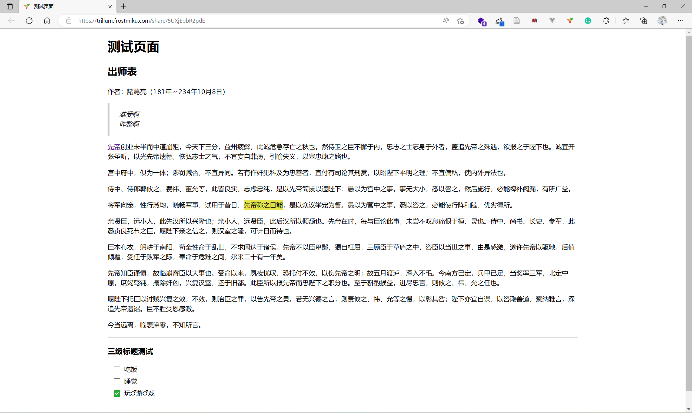
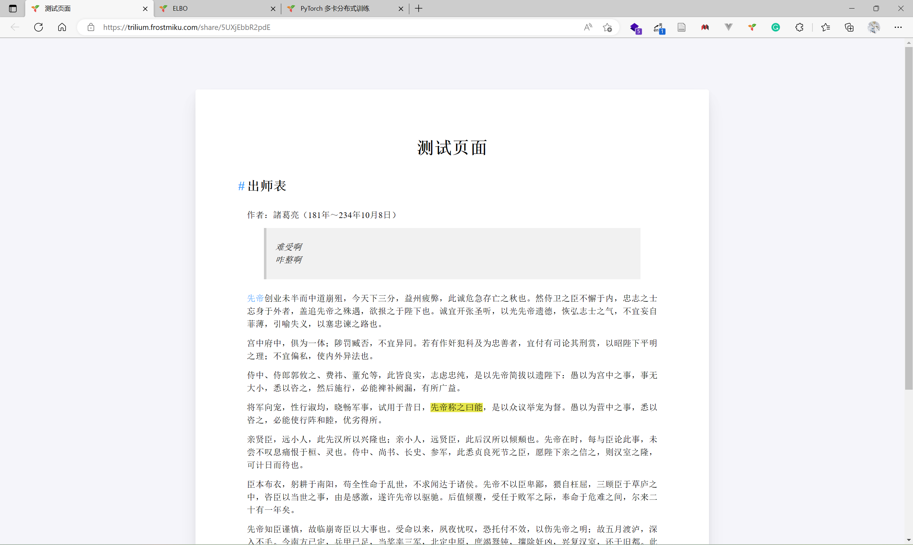
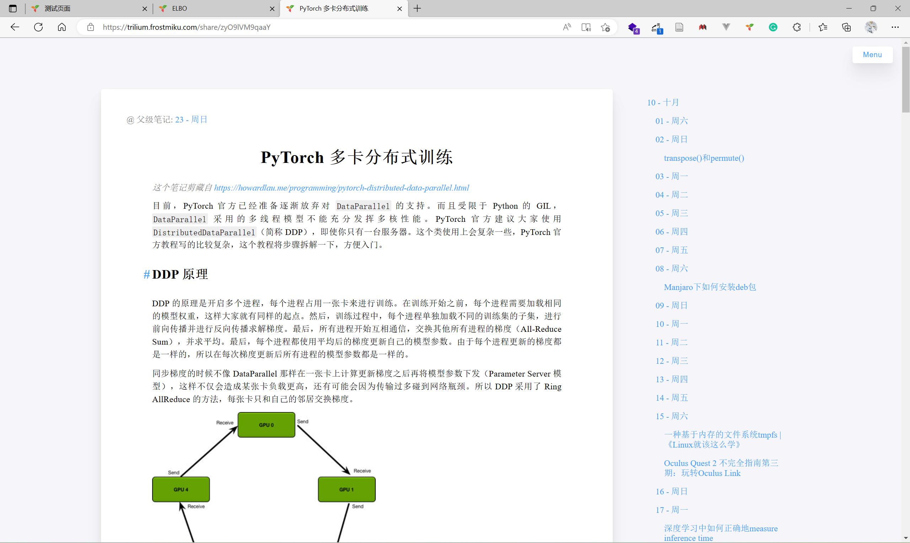
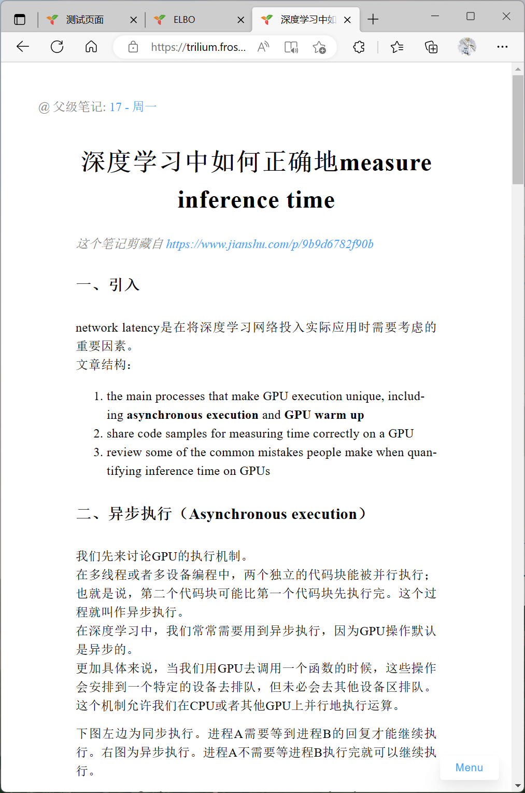

# Share.CSS

Sharing theme for Trilium Note.
Can also be used for paper page.

This fork added title enumeration and Print css for better printing layout. 

## Screenshot

- Before:


- After:




## How to use

1. import `src/share.css` and `src/print.css` in trilium
2. clone the notes into your Sharing Tree
3. add two ~shareCss relations, pointing to the share.css and the print.css code notes which will be linked in the shared page
    1. in case you want this to apply to the whole subtree, add the ~shareCss relations to the top level "Shared Notes" note in your Sharing Tree. Don't forget to make the label inheritable.
    2. If you want to hide this css code note from left tree navigation, add #shareHiddenFromTree label to the CSS code notes.

[See the Trilium wiki for more information](https://github.com/zadam/trilium/wiki/Sharing)

## For paper page

This theme can also be used for page which have the fixed structure like this:
```html
<body>
    <div id="layout">
        <div id="main">
            <h1 id="title">...</h1>
            <div id="content">
                <p>...</p>
            </div>
        </div>
    </div>
</body>
```

[Like this](https://blog.frostmiku.com/Flow-VAE-VC/)

## Contribute

Welcome PR

## Thx

- https://github.com/sivan/heti
- https://github.com/CaiJimmy/hugo-theme-stack
